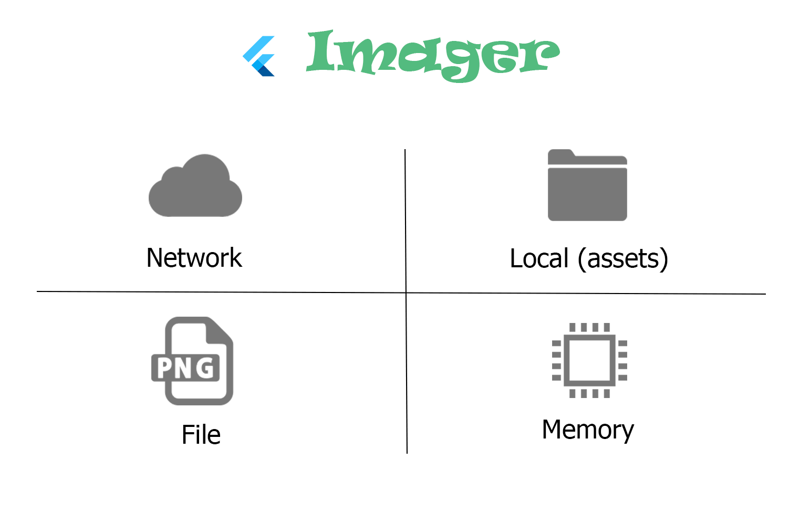

# imager
[](https://pub.dev/packages/imager)

Flutter package to conveniently work with image widgets which comes from network, local, file and memory



## Features

- Load images from Network, Local, Memory and File sources (plus DecorationImage for Container widget)
- Cache network images using [cached_network_image](https://pub.dev/packages/cached_network_image) package
- Show svg pictures using [flutter_svg](https://pub.dev/packages/flutter_svg) package
- Ability to add decoration and make your image curved and use other shapes
- Web friendly
- Support Padding and Margin
- Mirror your image
- Circle image
- Choosing proper widget based on source type (eg. svg, png, gif,...)
- Occupy defined height and width before loading the image (to avoid flicker)

## Usage
1. To use this plugin, add [imager](https://pub.dev/packages/imager/install) as a dependency in your pubspec.yaml file.

```yaml
dependencies:
  imager: ^lastVersion
```

2. For network images, define your placeholder image

```dart
void main() {
  Imager.placeholderPath = 'assets/placeholder.png';
  runApp(const MyApp());
}
```

3. Load your image using `Imager` utility class

```dart
class _MyHomePageState extends State<MyHomePage> {
  @override
  Widget build(BuildContext context) {
  return Scaffold(
    appBar: AppBar(
      title: Text(widget.title),
    ),
    body: Center(
      child: Imager.fromNetwork('https://docs.flutter.dev/assets/images/flutter-logo-sharing.png'),
    ),
  );
 }
}

```
